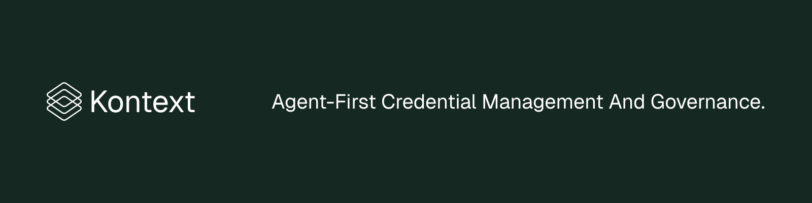

<div align="center">



<p><strong>Watch every action your AI coding agent takes. Inject credentials it never stores.</strong></p>

<p>
  <a href="https://kontext.security">Website</a>
  ·
  <a href="https://docs.kontext.security/getting-started/welcome">Documentation</a>
  ·
  <a href="https://app.kontext.security">Dashboard</a>
  ·
  <a href="https://discord.gg/gw9UpFUhyY">Discord</a>
</p>

<p>
  <a href="LICENSE"></a>
  <a href="https://github.com/kontext-security/kontext-cli/releases"></a>
  
</p>

</div>

## What is Kontext CLI?

Kontext CLI is an open-source command-line tool that wraps AI coding agents with a local safety layer and enterprise-grade credential management — without changing how developers work.

**Why we built it:** Agents like Claude Code now run shell commands, edit code, open pull requests, and call provider APIs from your machine. Most of the time that is exactly what you want. Sometimes it is `rm -rf`, `gcloud sql databases delete prod`, `git push --force main`, or a command that leaks a secret before you notice. Teams also still copy-paste long-lived API keys into `.env` files and hope for the best.

**How it works:** `kontext guard start` runs a local daemon that captures Claude Code tool calls, redacts them, scores risk, and surfaces risky actions in a local dashboard. Guard mode observes today; later it can ask before risky commands run and block the delete-prod class outright. `kontext start --agent claude` adds team governance: short-lived RFC 8693 credentials are injected per session and expire when the agent exits.

## Quick Start

```bash
brew install kontext-security/tap/kontext
kontext guard start
claude
```

That is it: local-only, no login, observe mode. The dashboard opens at `http://127.0.0.1:4765`.

To add credential injection, hosted traces, and team policy, run `kontext start --agent claude` from a project with Claude Code installed.

## Operating Modes

| Mode | Command | Best for | Login required |
| --- | --- | --- | --- |
| Guard | `kontext guard start` | Solo developers, local risk visibility, real-time notifications | No |
| Hosted | `kontext start --agent claude` | Teams, scoped credentials, shared traces, governance | Yes |

## What You Get

| Capability | What it means |
| --- | --- |
| Local Guard mode | A local daemon watches Claude Code tool calls, scores risk, and stores redacted traces in SQLite. |
| Observe-mode notifications | Risky actions are surfaced as `would ask` or `would deny` without blocking Claude Code. |
| Local dashboard | Review sessions, actions, reasons, risk scores, and signals at `127.0.0.1:4765`. |
| Ephemeral credentials | Short-lived tokens are injected only for the active hosted agent session. |
| Managed env file | The CLI creates and updates `.env.kontext` with provider placeholders. |
| Hosted connect | Missing user providers open a browser flow instead of leaking keys locally. |
| Governed sessions | PreToolUse, PostToolUse, and UserPromptSubmit events stream to Kontext in hosted mode. |
| Native runtime | A small Go binary. Guard mode has an embedded dashboard; installed users do not need Node or Docker. |

## Managed Credentials

Hosted mode creates `.env.kontext` locally on first run:

```dotenv
GITHUB_TOKEN={{kontext:github}}
LINEAR_API_KEY={{kontext:linear}}
```

Keep `.env.kontext` out of source control in repos that do not already ignore it. The CLI may append more preset provider placeholders later if your org attaches them to the shared Kontext CLI application. Literal values you add stay untouched. Providers connected after the agent has already started become available on the next `kontext start`.

## Providers and Traces

Provider setup and trace review live in the hosted dashboard at [app.kontext.security](https://app.kontext.security). Use the same account you used for `kontext login`.

**Add providers**

1. Open **Providers** in the dashboard.
2. Add a built-in provider, such as GitHub or Linear, or create a custom provider.
3. For built-in providers, configure allowed scopes and any provider-specific OAuth settings shown in the dashboard. For custom providers, choose end-user OAuth, end-user key, or organization key.
4. Open **Applications** → **kontext-cli** → **Providers** and attach the providers the CLI application can use.
5. Reference the provider handles in `.env.kontext`.

**Check traces**

1. Run `kontext start --agent claude`.
2. Ask Claude Code to perform a tool-using task.
3. Open **Traces** in the dashboard to inspect live hook events, tool calls, outcomes, user attribution, and session context.

## Security

- Guard mode is local-only by default: no login, no hosted API, no trace upload.
- Guard mode stores redacted events in local SQLite and scores risk with local rules plus a local JSON Markov-chain model.
- Hosted mode uses OIDC browser login with refresh tokens stored in the system keyring.
- Hosted mode uses RFC 8693 token exchange for short-lived, provider-scoped runtime credentials.
- Provider credentials stored in Kontext are encrypted at rest with AES-256-GCM.
- Long-lived provider keys are not written to the project or agent config by Kontext.
- Kontext captures tool events and outcomes. It does not capture LLM reasoning, token usage, or full conversation history.

## Supported Agents

| Agent | Guard mode | Hosted mode | Status |
| --- | --- | --- | --- |
| Claude Code | `kontext guard start` | `kontext start --agent claude` | Active |

Cursor, Copilot, and Codex support are planned, but they are not shipped in this repo yet.

## Architecture

Guard mode:

```text
kontext guard start
  │
  ├─ Hooks: generated Claude Code settings.json
  │    │
  │    ├─ PreToolUse        → kontext guard hook claude-code
  │    ├─ PostToolUse       → kontext guard hook claude-code
  │    └─ UserPromptSubmit  → kontext guard hook claude-code
  │
  ├─ Local daemon: 127.0.0.1:4765
  ├─ Risk engine: deterministic rules + Markov-chain score
  ├─ Store: local SQLite with redacted events
  └─ Dashboard: embedded local web UI + notifications
```

Hosted mode:

```text
kontext start --agent claude
  │
  ├─ Auth: OIDC refresh token from system keyring
  ├─ ConnectRPC: CreateSession → governed session in dashboard
  ├─ BootstrapCli: sync managed provider entries into .env.kontext
  ├─ Token exchange: {{kontext:provider}} → short-lived credential
  ├─ Sidecar: Unix socket server + heartbeat loop
  ├─ Hooks: generated Claude Code settings.json
  │    │
  │    ├─ PreToolUse        → kontext hook → sidecar → ProcessHookEvent
  │    ├─ PostToolUse       → kontext hook → sidecar → ProcessHookEvent
  │    └─ UserPromptSubmit  → kontext hook → sidecar → ProcessHookEvent
  │
  └─ Exit: EndSession → credential expiry + temp file cleanup
```

## Useful Commands

```bash
kontext guard status      # show local Guard counters
kontext guard dashboard   # open or print the local dashboard URL
kontext guard doctor      # check daemon and Claude Code hook state
kontext doctor            # inspect global Kontext CLI setup
kontext start --verbose   # print redacted hosted-mode diagnostics
```

## Development

```bash
go build -o bin/kontext ./cmd/kontext
go test ./...
go test -race ./...
go vet ./...
pnpm install --frozen-lockfile
pnpm build
make guard-e2e
```

Generate protobuf code with:

```bash
buf generate
```

Service definitions live in [kontext-security/proto `agent.proto`](https://github.com/kontext-security/proto/blob/main/proto/kontext/agent/v1/agent.proto).

## Community

- Read [SUPPORT.md](SUPPORT.md) for support channels.
- Read [CONTRIBUTING.md](CONTRIBUTING.md) before opening a contribution.
- Kontext CLI is released under the [MIT License](LICENSE).
